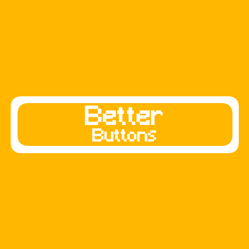

# Better Buttons
A Minecraft mod made to customize Minecraft's default buttons

## Installation links
- [Modrinth](https://modrinth.com/project/betterbuttons)

## Issues
- Report an issue on the [issues tracker](https://github.com/squiddew1/Better-Buttons/issues)

## Sources
- Sources available on [GitHub](https://github.com/squiddew1/Better-Buttons)

## License
This project is licensed under the MIT license. See the [LICENSE](LICENSE.md) file.